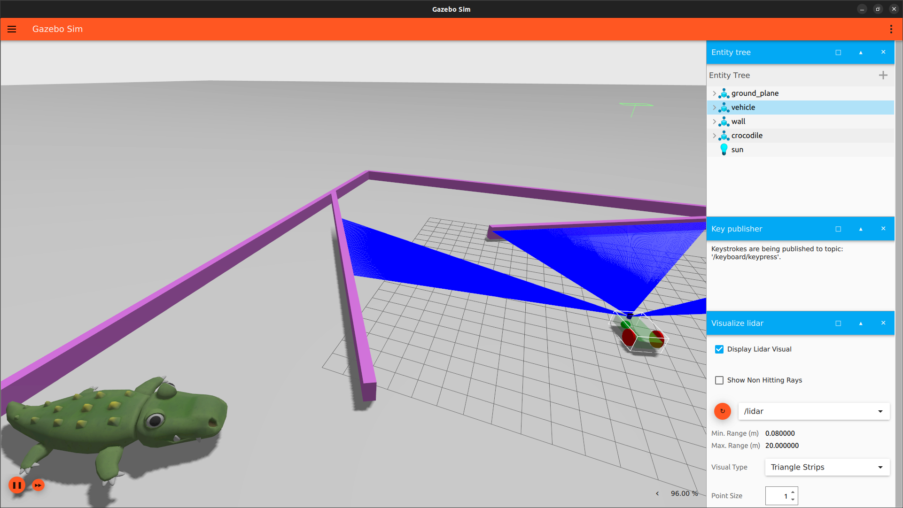
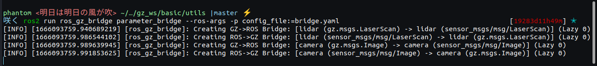
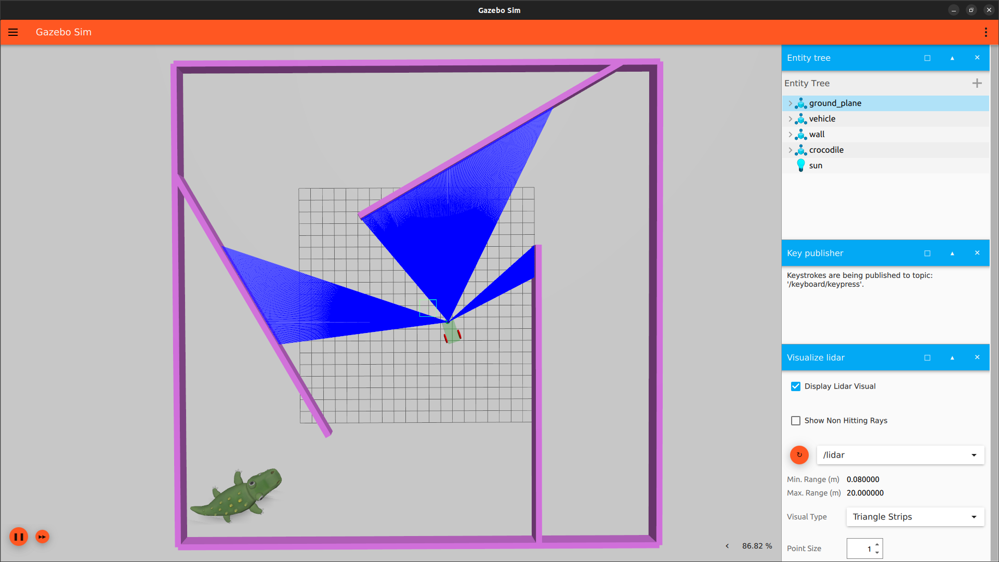
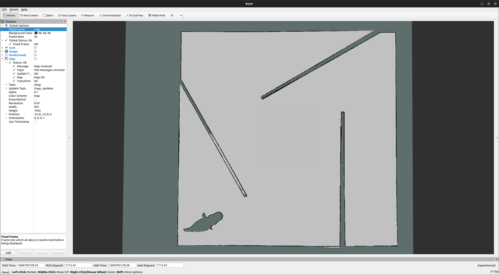

# <div align="center">Simple Car Simulation<br>with Gazebo & ROS2</div>

<div align="center">
    
    <p>
        This is a reposity for autonomous car simulation,equipped with toturials and necessary nodes.
        <br>A standalone package without other algorithms inside.
    </p>

(**Due to finish before leaving school**)

English | [简体中文](README_cn.md)

</div>

## <div align="center">Details</div>
<details open>
<summary>Environment</summary>

- [Gazebo-Garden](https://gazebosim.org/docs)
- [ROS2-Humble](https://docs.ros.org/en/humble/index.html)
- [ros_gz](https://github.com/gazebosim/ros_gz)

    Above resources are all necessary.

    Make sure the version of ROS2 and Gazebo match each other.

</details>

<details open>
<summary>Folders & Components</summary>

- build : use CMakeLists & Makefile to generate excutable binary here
- images : displaying in docs
- launch : use **.ign** format to start all nodes just like wht launch files do in ros
- models : models downloaded from [gazebo-fuel](https://app.gazebosim.org/dashboard)
- sdf : custom world and cars in **.sdf** format
- src : source code with gazebo-node to communicate
- utils : some useful scripts or tools

</details>

<details open>
<summary>Interaction with ROS2</summary>
Gazebo node has its own message format,which means a bridge is needed to transport messages between gazebo and ros

```bash
# hold the bridge only for one type of message
#[format]: 
ros2 run ros_gz_bridge parameter_bridge [gz_topic_name]@[ros_topic_type]@[gz_topic_type]
#[example]: 
ros2 run ros_gz_bridge parameter_bridge /camera@sensor_msgs/msg/Image@gz.msgs.Image

# hold the bridge for some common messages
ros2 run ros_gz_bridge parameter_bridge --ros-args -p config_file:=$PATH/TO/THIS/REPO/utils/bridge.yaml
```
Terminal will print such output if bridge works<br>
<div align="center"></div>

More types of messages can be found [here](README_msg_types.md) 

</details>
<details open>
<summary>Quick Start</summary>

1. Click on the environment tag and follow their own install instructions<br>
   
2. Git clone this repo
3. ```bash
    cd $PATH/TO/THIS/REPO
    gz launch launch/diffdrive.ign
    ```

</details>

<details open>
<summary>To Do List</summary>
  
- Add different types of cars : **Ackermann**,**Mecanum**,**Crawler**
- Add one more world.sdf with realistic road or obstacles
- Add perception node(**SLAM with lidar/cam/imu**)
- Ameliorate docs

</details>

## <div align="center">Modules</div>
<details open>
<summary>Perception</summary>

1. Git clone [ros2_gmapping](https://github.com/Project-MANAS/slam_gmapping) & tf_publisher(not available yet)
2. ```bash
    ros2 run tf_publisher odom_tf
    ros2 launch slam_gmapping slam_gmapping.launch.py
    cd $PATH/TO/THIS/REPO/utils & ./bridge.sh
    ```
3. Click the start button in gazebo & see what happens in rviz2

<div align="center"></div>
</details>

<details open>
<summary>Planning</summary>
<p>To be done</p>
</details>

<details open>
<summary>Control</summary>
<p>To be done</p>
</details>

## <div align="center">Contact</div>
Welcome all questions in issues tag or if u wanna contact me at nocap.wzh@gmail.com